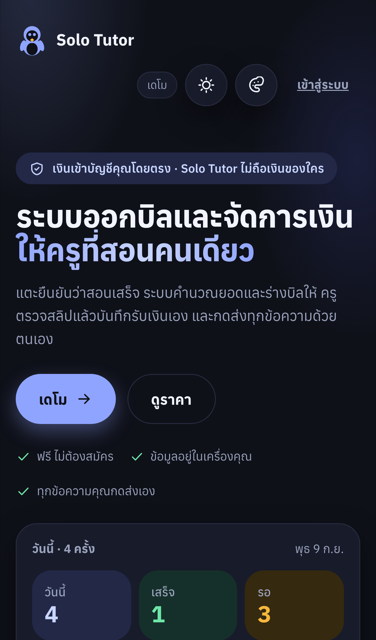
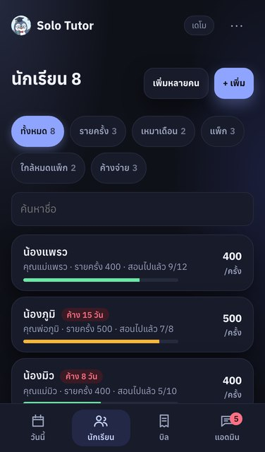
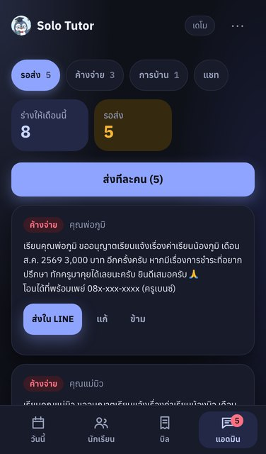
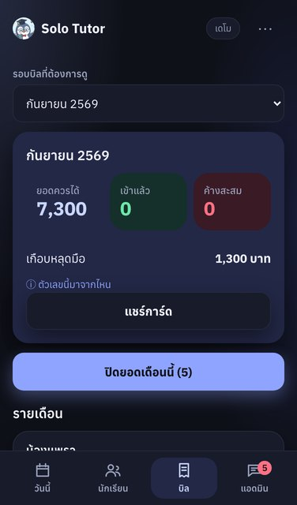
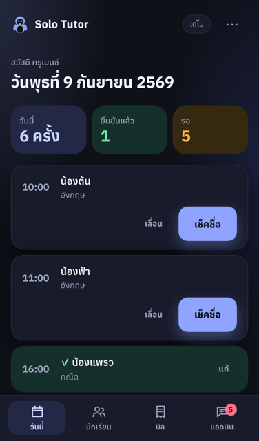

# Solo Tutor — แอดมินส่วนตัวของติวเตอร์

Back-office for a tutor who teaches alone. Tap once to mark a session taught; at month end the app totals every student, drafts the bill and the LINE message in the teacher's own voice, and the teacher reads it and presses **ส่งใน LINE**. The parent needs nothing but LINE: a message, a link with the exact-amount PromptPay QR, and a receipt when the slip arrives. The ledger lives in the teacher's browser; signing in adds an encrypted cloud copy the server cannot read. Solo Tutor never holds money.

**Try it now:** https://tasachii.github.io/solo-tutor/ — the demo opens with sample data and no sign-up; it installs as an app and works offline.

<p align="center"></p>

| หน้าแรก — one button into the demo | วันนี้ — one tap per session |
|---|---|
|  |  |

| นักเรียน — each student with their own billing mode | แอดมิน — drafts waiting for the teacher to read and send |
|---|---|
|  |  |

| บิล — the month at a glance | The same page with the network off |
|---|---|
|  |  |

## Contents

- [Why this exists](#why-this-exists)
- [Features](#features)
- [Architecture](#architecture)
- [Requirements](#requirements)
- [Installation](#installation)
- [Usage](#usage)
- [Testing](#testing)
- [Project documentation](#project-documentation)
- [Roadmap](#roadmap)
- [License](#license)

## Why this exists

A solo tutor with 11–50 students keeps attendance in a notebook, a phone note and a LINE thread, then spends the last evening of the month counting sessions, typing amounts into chats one by one, and hesitating to remind the parents who have not paid. Existing tools fail on the parent side: parents refuse to install another app. Solo Tutor keeps the parent inside LINE and keeps the teacher in charge of every word — the app drafts, the teacher sends. Four rules are enforced in code, not policy: the app holds no money (tuition goes straight to the teacher's PromptPay), every number comes from the ledger, no message leaves without the teacher pressing a button, and messages to parents carry the teacher's voice and particle (ครับ/ค่ะ) — never the words "ระบบ", "อัตโนมัติ" or the app's name.

## Features

### Daily teaching
- **วันนี้** lists today's sessions with done/waiting counters; **เช็คชื่อ** marks one taught, a repeat tap does not double-count, and a toast undoes it
- **+ เพิ่มวันนี้** adds an unscheduled session; **เลื่อน** and **งดคาบนี้** move or cancel one and draft the parent message on the spot — the bill is computed from attendance, not the timetable
- Packages that are down to 1–2 sessions raise a renewal draft; an exhausted package still allows attendance but says the session is not yet paid

### Students and pricing
- Add one at a time (name, payer — siblings can share one — LINE ID, and a billing mode: รายครั้ง · เหมาเดือน · แพ็ก of 10 or 20 or a custom count) or **เพิ่มหลายคน** by pasting from Excel, Google Sheets or LINE, or uploading CSV/XLSX; headers are guessed, duplicates dropped
- Filters: ทั้งหมด · รายครั้ง · เหมาเดือน · แพ็ก · ใกล้หมดแพ็ก · ค้างจ่าย
- Price changes mid-month apply to new sessions only; the billing mode cannot change while unbilled work exists, and the app says why
- Pause a student (history kept, not counted toward the free cap), resume, or delete — a deleted student stays deleted across backups, devices and the cloud, and the server forgets the payer too

### Month end and money
- **ปิดยอดเดือนนี้** creates one bill per student with attendance (per-session × rate, or the flat amount); pressing it twice does not duplicate
- The bill message carries the amount, a **โอนได้ที่พร้อมเพย์ 08x-xxx-xxxx (ชื่อครู)** line when the teacher's PromptPay is a phone number (a national-ID PromptPay is never printed), and a link to the bill page with an EMVCo PromptPay QR that already contains the amount
- **รับยอดจากสลิป** records a payment: exact, partial (balance falls accordingly), over-paid (recorded at the bill, slip amount noted) or unreadable (confirmed by hand); confirming twice never issues two receipts
- Receipts issue themselves when a bill is fully paid, numbered `SL-YYYYMM-NNN`, printable, and sent as a link
- Dashboard per billing round: ยอดควรได้ · เข้าแล้ว · ค้างสะสม · เกือบหลุดมือ (money the app caught), each with a note on where the figure comes from
- CSV exports for attendance and bills/payments, with a BOM so Thai Excel opens them cleanly

### Messages to parents
- Every message is drafted from the ledger: new bill · three-step balance notices (สุภาพ → ชัดเจน → รอบสุดท้าย by days overdue) · a short nudge · package renewal · receipt · moved/cancelled session · mid-month summary · homework and homework reminders · answers to parent questions
- **ส่งใน LINE** is one button: if the parent is paired with the teacher's LINE OA the message goes out through the OA; if not, the LINE app opens with the message for the teacher to send. A message whose numbers changed after drafting cannot be sent
- **ค้างจ่าย** tab: every unpaid bill in one place, sorted by days overdue, with the notice step due, the last notice sent and how many; **การบ้าน** tab: assign to several students at once, track received/overdue, reminders draft themselves
- **แชท**: a parent's question in the OA (how much, is there class, sessions left, paid yet) gets an answer drafted from real data for the teacher to approve

### LINE OA
- A teacher connects their own OA once (Channel secret + long-lived token, encrypted at rest); the app sets the webhook URL and runs LINE's endpoint test itself
- A parent pairs with a six-digit code, single-use, valid 24 hours; **คัดลอกข้อความเชิญผู้ปกครอง** copies a complete invitation — add-friend link plus code — in the teacher's voice to paste into the existing chat. Typing **หยุด** unsubscribes
- Sends go through an outbox with de-duplication keys, survive a dropped connection, can be cancelled before delivery, and count against LINE's free 300 messages/month

### Parent side
- No app, no account: a LINE message, and a link that opens the bill in LINE's browser with the QR, balance, bill history and the next session
- Links are encrypted in the teacher's browser; only ciphertext reaches the server and the key travels after `#` so no server ever sees it. Links expire after 90 days and the teacher can revoke one from the account screen (revocation stops future opens; a copy already saved cannot be recalled)

### Data and platform
- Local-first: the ledger is in `localStorage`, attendance works offline; a second tab of the same book is read-only so tabs never overwrite each other
- Backup to a JSON file and restore (the file is validated first; a copy of the current book is parked before restore); optional write-only mirror to a Google Sheet in the teacher's own Drive
- Teacher account: the whole ledger is encrypted with a key derived from the teacher's password before it is uploaded; a recovery-key file is offered because the server cannot decrypt it. Two devices editing at once are asked which copy to keep — nothing is overwritten silently
- Installable PWA; when a new release is waiting, a toast **มี Solo Tutor เวอร์ชันใหม่แล้ว · โหลดใหม่** appears and every open tab reloads together on tap
- Five themes, six accent colours, three display sizes including a projection size for presenting
- Free for up to 5 active students; Pro at 299 ฿/month, 799 ฿/3 months or 2,490 ฿/12 months by bank transfer, approved by a person — no card on file

## Architecture

```
Teacher's browser (React SPA on GitHub Pages, installable PWA)
  ledger in localStorage  ─── AES-GCM ───▶  ledger_snapshots (ciphertext only)
  documents encrypted here ─ key stays in the URL fragment ─▶ shared_documents (ciphertext only)
        │
        ▼
Supabase (Singapore · PostgreSQL 17 · Auth · RLS on every table)
  Edge Functions: line-connect · line-webhook · line-send · usage · waitlist · report-error · delete-account
  Tables: providers · line_channels (sealed secret/token) · line_recipients · line_link_codes
          message_outbox · chats · shared_documents · usage_events · plan_requests · plan_financial_evidence
        │
        ▼
LINE Messaging API  ◀──▶  the teacher's LINE OA  ◀──▶  the parent's LINE
```

| Layer | Role | Key technology |
|---|---|---|
| `src/core/` | Ledger, billing, message drafting, FAQ answers, selectors, tombstones, document crypto | TypeScript, no framework code |
| `src/app/` | Teacher screens and the parent-facing bill/receipt pages | React 18, react-router-dom (HashRouter), plain CSS |
| `src/platform/` | Landing, pricing, login, legal pages | React |
| `src/professions/` · `src/copy/` | Vocabulary, billing rules and message templates per profession; all UI strings | TypeScript |
| `supabase/migrations/` | 19 migrations, all applied to the live project | PostgreSQL 17, PL/pgSQL, pgcrypto |
| `supabase/functions/` | 7 Edge Functions | Deno |
| `.github/workflows/` | Verify and deploy on push, hourly health check, 6-hourly uptime probe, daily encrypted backup, weekly quality run, and three hand-pressed jobs (apply migrations, ops report, release a LINE channel) | GitHub Actions |

Design decisions worth noting:

- **The ledger is the only source of numbers.** Bills, balances, package counts and every message are derived from attendance and payments the teacher confirmed; nothing is stored twice and no template carries a figure.
- **Drafts are the product, sending is the teacher's act.** Every outbound message is shown before it goes; one button, **ส่งใน LINE**, picks the OA when the parent is paired and the LINE app when not. A failed link publish sends nothing anywhere.
- **The server cannot read what matters.** The cloud ledger is encrypted with a password-derived key in the browser; parent links are AES-GCM with the key in the URL fragment; LINE credentials are sealed with a server-side key and never returned. A forgotten password locks that account's cloud copy — which is why the recovery-key download exists.
- **One LINE OA belongs to one teacher account.** The webhook verifies signatures against the secret stored for that channel, so credentials must be saved in the app before LINE's Verify button is pressed.
- **The service worker keeps the waiting lifecycle.** A new release activates only after every tab has closed, so old tabs never mix chunks from two builds; the reload toast lets the teacher end the wait on purpose and reloads all tabs together.
- **Demo and real books are separate slots.** Trying the demo, resetting it, or opening two tabs in different modes never touches a teacher's real ledger.
- **HashRouter** because GitHub Pages has no SPA fallback; dates are stored as ISO (CE) and displayed in BE, computed with `Date.UTC` so no timezone leaks in.

## Requirements

- Node.js 22 (`engines`: `>=22 <25`; `.nvmrc` pins 22)
- Docker, only for the PostgreSQL suite (`npm run test:db` runs the migrations and contract tests on postgres:16 and postgres:17)
- Deno, only for the Edge Function tests (`npm run test:edge`)
- A Supabase project and a LINE Messaging API channel are needed for real mode; the demo needs neither

## Installation

```bash
git clone https://github.com/Tasachii/solo-tutor.git
cd solo-tutor
npm install
```

Real mode reads its project from build-time variables; without them the app runs demo-only and says so on the account screen:

| Variable | Purpose |
|---|---|
| `VITE_SUPABASE_URL` | Supabase project URL |
| `VITE_SUPABASE_PUBLISHABLE_KEY` | Supabase publishable key |
| `VITE_SUPPORT_CONTACT` | `https://` link, email or `@handle` shown as the team contact; a `line.me` link also becomes the **เพิ่มเพื่อน LINE** footer link |
| `VITE_PROVIDER_LEGAL_NAME` | Payee name on Pro receipts; optional |
| `VITE_SOLO_PROMPTPAY` | The team's PromptPay for Pro payments — 10-digit phone or 13-digit ID; optional, only enables the **ขอเปิด Pro** QR |

On GitHub Pages these are repository **Variables** (not secrets — they ship in the bundle).

## Usage

### Development

```bash
npm run dev
```

The demo needs no backend. Useful URL parameters, in the query or after the hash:

| Parameter | Effect |
|---|---|
| `?scenario=default` | Pick the demo data set: `default` · `per-unit` · `flat-heavy` · `package-heavy` · `monthly-heavy` · `empty` |
| `?stay=1` | Show the landing page even when a real-mode teacher would normally land on วันนี้ |
| `?c=line` | Attribute the visit to a campaign; allowed values are `line` · `facebook` · `qr` · `pitch` · `friend`. Sharing the site with `?c=…` also gives LINE a fresh link preview |

### Deploy

Every push to `main` runs the **Verify and deploy** workflow — typecheck, unit, SQL, edge and browser suites — and publishes `dist/` to GitHub Pages. Database changes are applied by hand: **Actions → Apply database migrations → Run workflow** and type `APPLY`; the job takes a backup first and refuses to continue past a failing file.

### A teacher's first month

1. **Start real mode.** `⋯` → **เริ่มใช้จริง** → enter the name parents use, the particle (ครับ/ค่ะ) and a PromptPay number → paste the class list or add students one by one.
2. **Teach.** On **วันนี้**, tap **เช็คชื่อ** after each session; use **+ เพิ่มวันนี้** for an unscheduled one.
3. **Connect LINE OA (optional).** `⋯` → **เชื่อม LINE OA** → sign in → paste the channel secret and token once. Next to each payer press **สร้างรหัสเชื่อม**, then **คัดลอกข้อความเชิญผู้ปกครอง** and paste it into the chat you already have with that parent; the parent adds the OA and types the code.
4. **Close the month.** **บิล** → **ปิดยอดเดือนนี้**.
5. **Send.** **แอดมิน** → **รอส่ง** → read each draft → **ส่งใน LINE**.
6. **Record the slip.** **บิล** → **รับยอดจากสลิป** → the receipt drafts itself → **ส่งใน LINE** again.
7. **Back up.** `⋯` → **สำรองข้อมูล** for a JSON file; sign in for the encrypted cloud copy and download the recovery key.

### Operations

| Workflow | Runs | Purpose |
|---|---|---|
| Verify and deploy | on push | Full test run, build, publish |
| Uptime and keep-alive | every 6 h | Site 200, database pong, Edge Functions answering; keeps the free project awake |
| Hourly operations check | hourly | Client errors, stale Pro requests, stuck outbox rows |
| Daily database backup | 03:35 Bangkok | Encrypted dump kept 90 days |
| Scheduled quality checks | weekly | The suites again, on a schedule |
| Apply database migrations | by hand, type `APPLY` | Backup, `supabase db push`, verify objects exist |
| Ops and usage report | by hand | Counts only: LINE pairing state, outbox, real-mode usage, verified money — no names, no secrets |
| Release LINE channel from its teacher account | by hand, type `RELEASE` | Detach the OA when its owner can no longer sign in |

A failing scheduled job opens one GitHub Issue labelled `ops-alert` and comments on it at most every six hours.

## Testing

```bash
npm test            # 864 unit tests in 104 files (vitest, jsdom, clock frozen at 2025-09-02)
npm run test:db     # 18 SQL contract files against every migration on postgres:16 and postgres:17 (Docker)
npm run test:edge   # 48 Edge Function tests (Deno)
npm run e2e         # 161 browser tests on the real build, Pixel 7 and desktop (Playwright)
npm run e2e:mock    # 30 LINE OA flows against a mocked backend
```

The browser suites share `./dist` and port 4173, so run them one at a time. A live-site pass at phone size — manifest, offline, long Thai names, backup file, check-in — is `node scripts/mobile-check.mjs`; it is deliberately not part of CI because it reaches the deployed site.

## Project documentation

- [`docs/features.md`](docs/features.md) — every capability, screen by screen, in Thai
- [`docs/owner-setup.md`](docs/owner-setup.md) — the steps only the owner can do, with the real values and the exact buttons
- [`docs/production-ledger.md`](docs/production-ledger.md) — every production task with its evidence, pass criterion and what is still open
- [`docs/data-inventory.md`](docs/data-inventory.md) — what data lives where, for how long, and the erasure gaps that code cannot close
- [`docs/incident-runbook.md`](docs/incident-runbook.md) · [`docs/backup-restore.md`](docs/backup-restore.md) — when something breaks, and how to restore from an encrypted dump
- [`docs/line-oa-setup.md`](docs/line-oa-setup.md) — connecting a LINE OA end to end
- [`docs/google-sheets/README.md`](docs/google-sheets/README.md) — the optional Sheets mirror
- [`handoff.md`](handoff.md) — the running record of every working session, authoritative for whoever picks the project up next

## Roadmap

Shipped in the last two days: separate demo and real ledgers, encrypted revocable parent links, tombstones so deleted students stay deleted everywhere, the owner analytics view, refunds visible to the teacher, the single **ส่งใน LINE** button, and the first real bill delivered through a LINE OA on 9 September 2026. Still open, in the order the ledger lists them: a "use this tab instead" takeover for the single-writer lock, a restore rehearsal against a real dump, and a per-student erasure policy for students who already have bills — that one needs a legal answer before code.

## License

MIT © Tasachii

Solo Tutor is a tool, not an intermediary: the teacher issues the bill, sends the message and receives the money directly. Nothing here is accounting or legal advice.
